

    <a href="./IMG_2076.JPG" _target="_blank">
        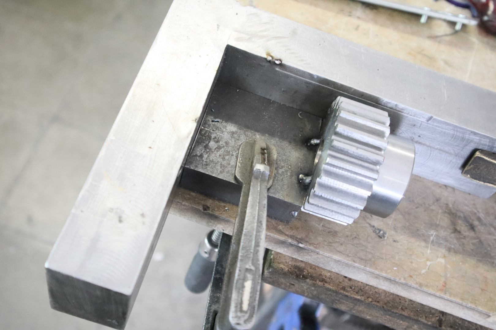
    </a>

    <a href="./IMG_2077.JPG" _target="_blank">
        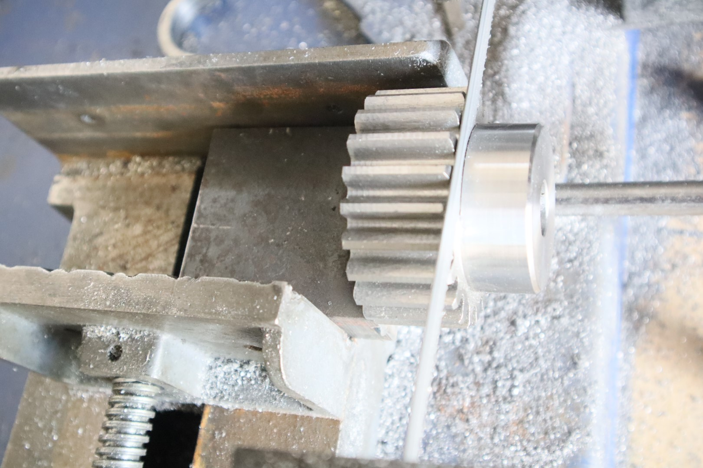
    </a>

    <a href="./IMG_2078.JPG" _target="_blank">
        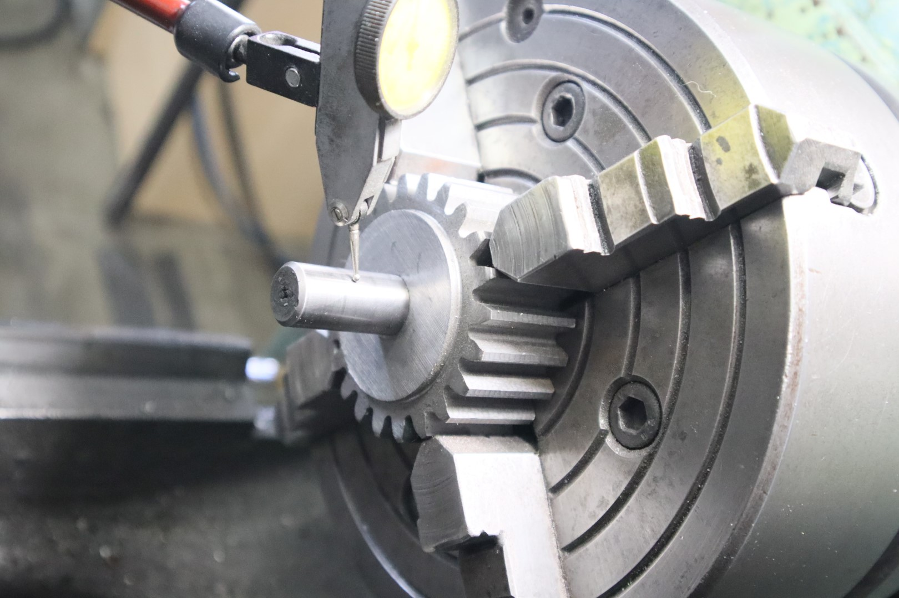
    </a>

    <a href="./IMG_2079.JPG" _target="_blank">
        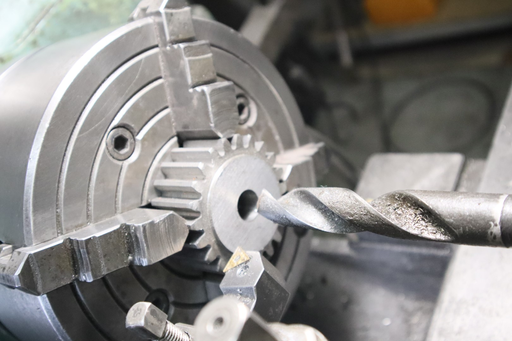
    </a>

    <a href="./IMG_2080.JPG" _target="_blank">
        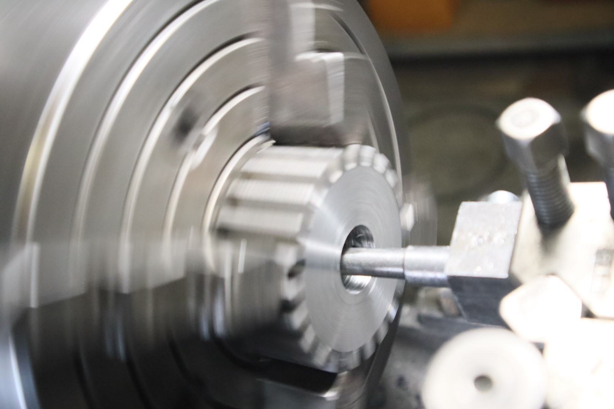
    </a>

    <a href="./IMG_2081.JPG" _target="_blank">
        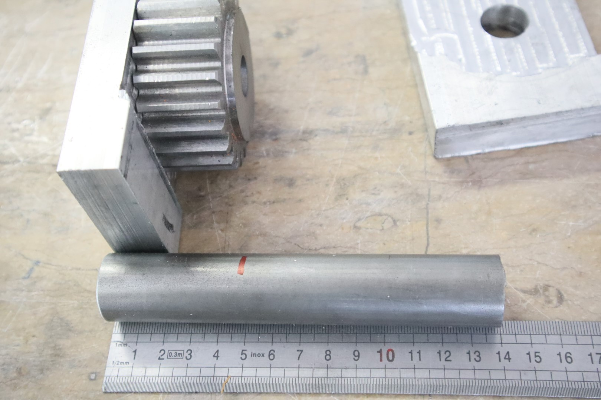
    </a>

    <a href="./IMG_2082.JPG" _target="_blank">
        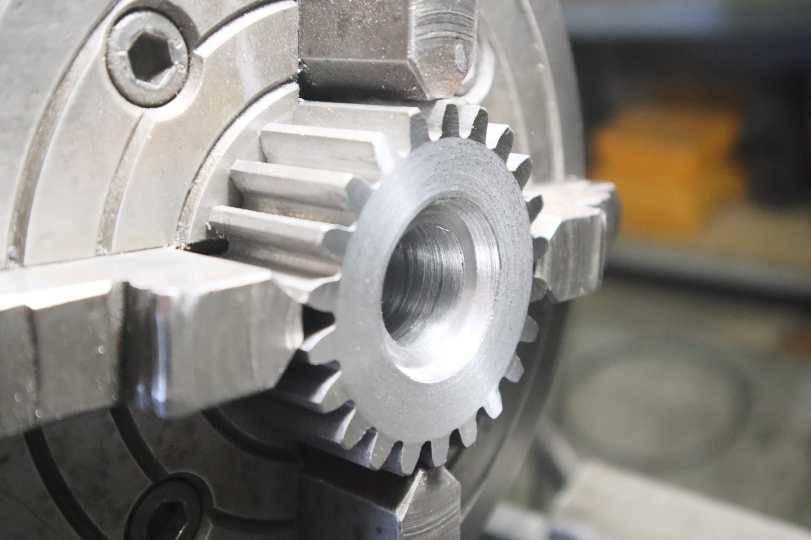
    </a>

    <a href="./IMG_2083.JPG" _target="_blank">
        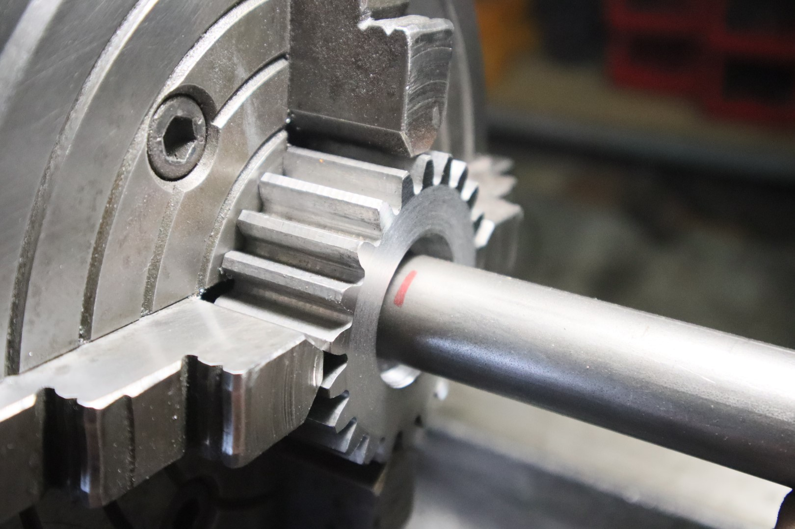
    </a>

    <a href="./IMG_2084.JPG" _target="_blank">
        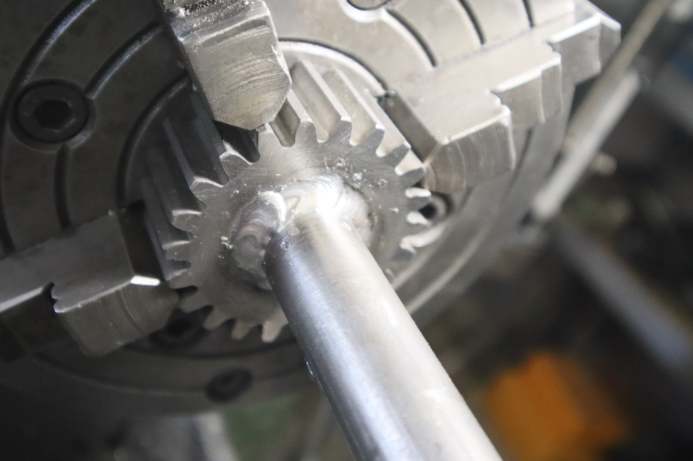
    </a>

    <a href="./IMG_2085.JPG" _target="_blank">
        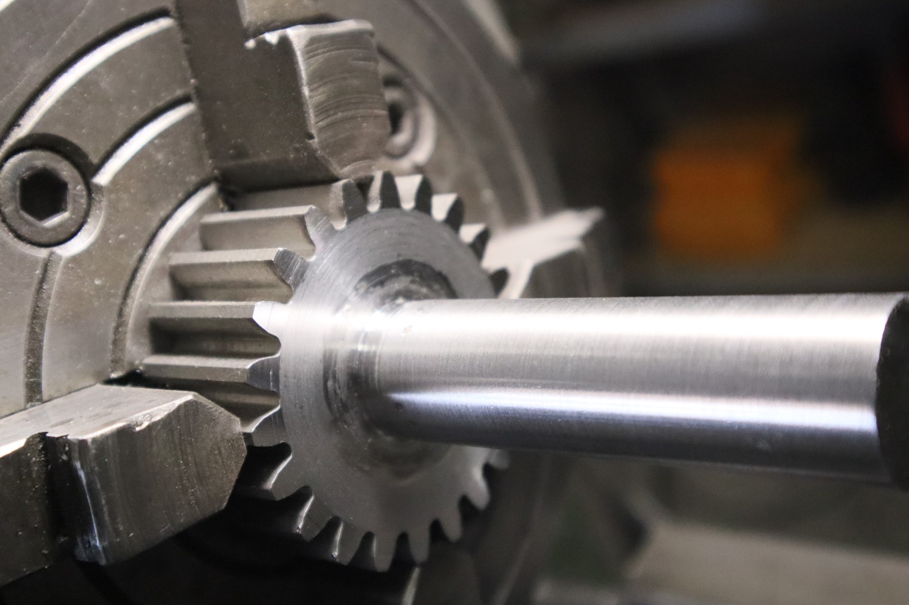
    </a>

    <a href="./IMG_2087.JPG" _target="_blank">
        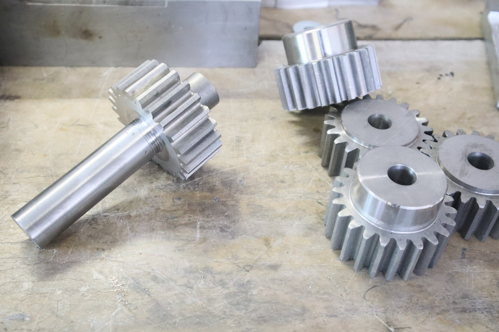
    </a>

