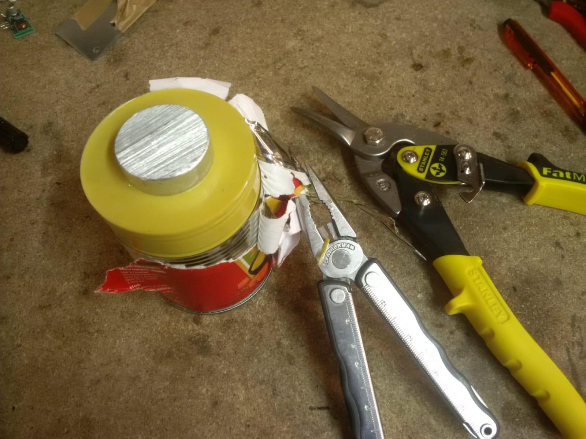
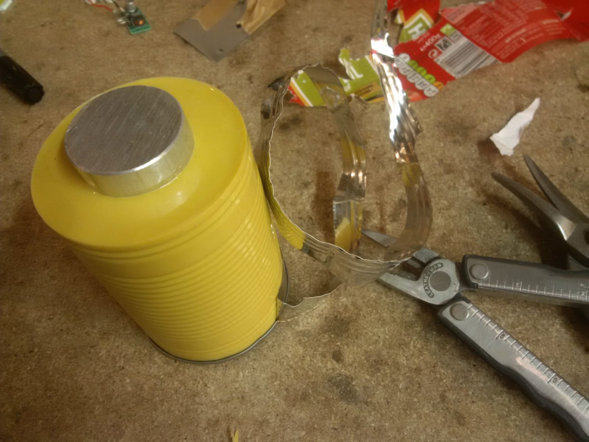
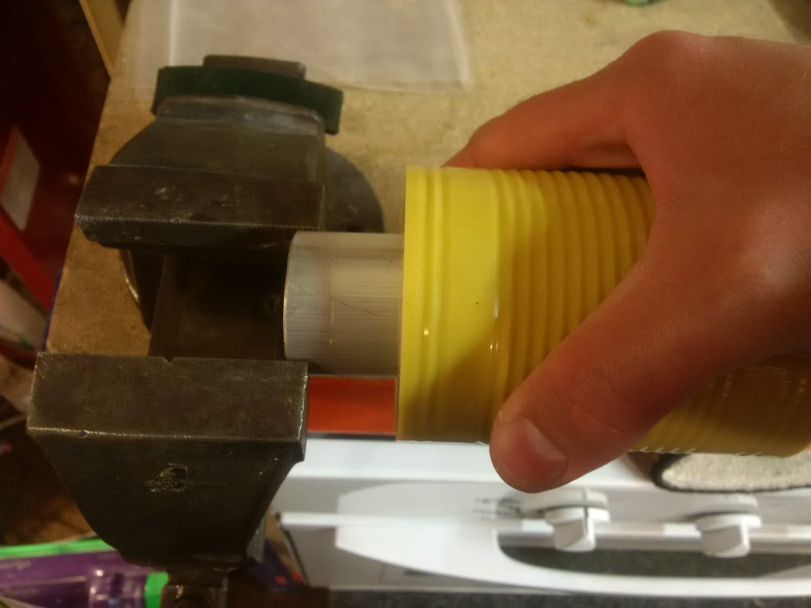
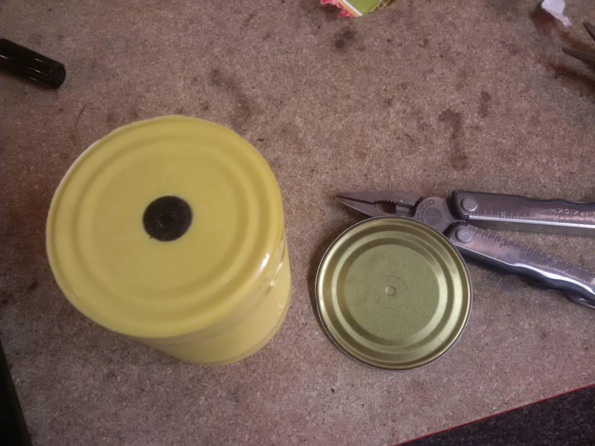
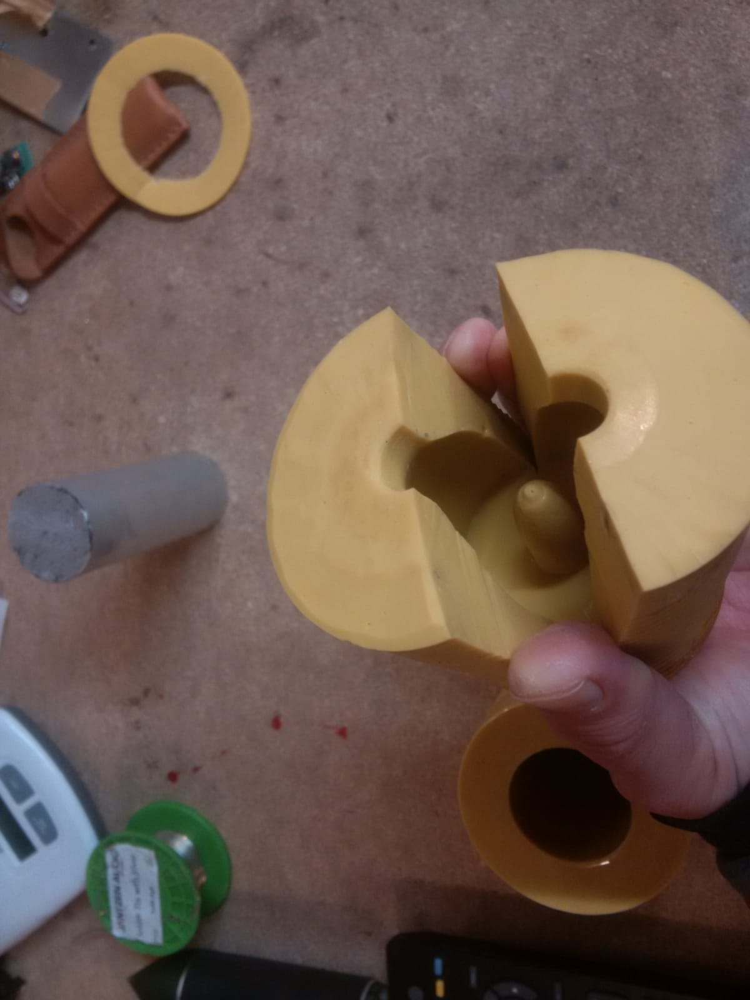
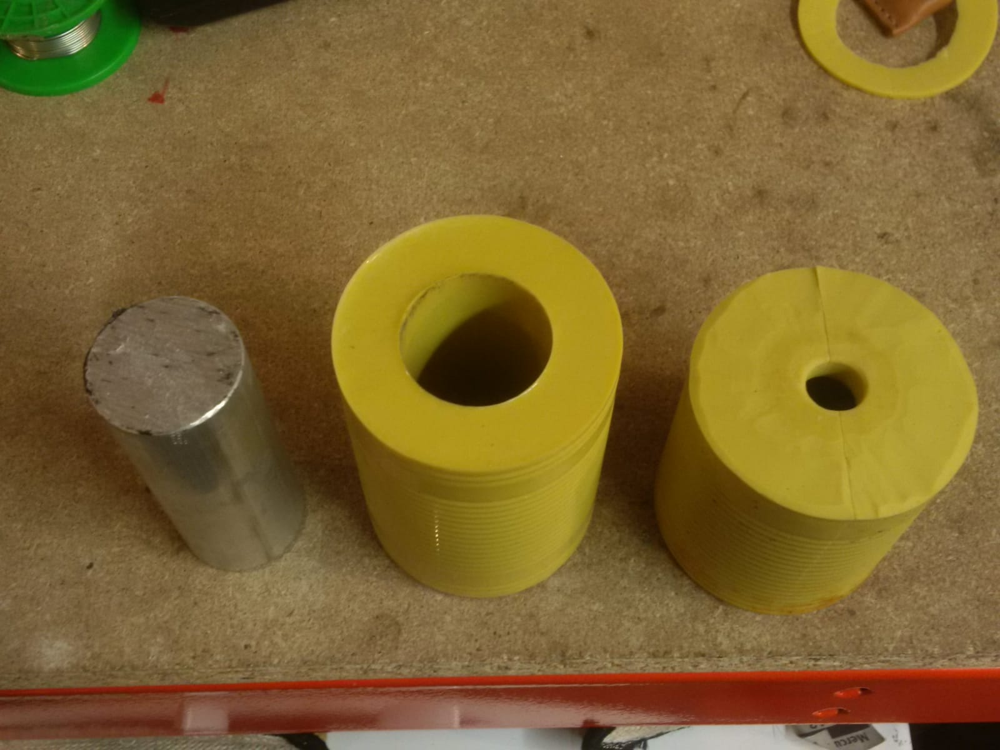
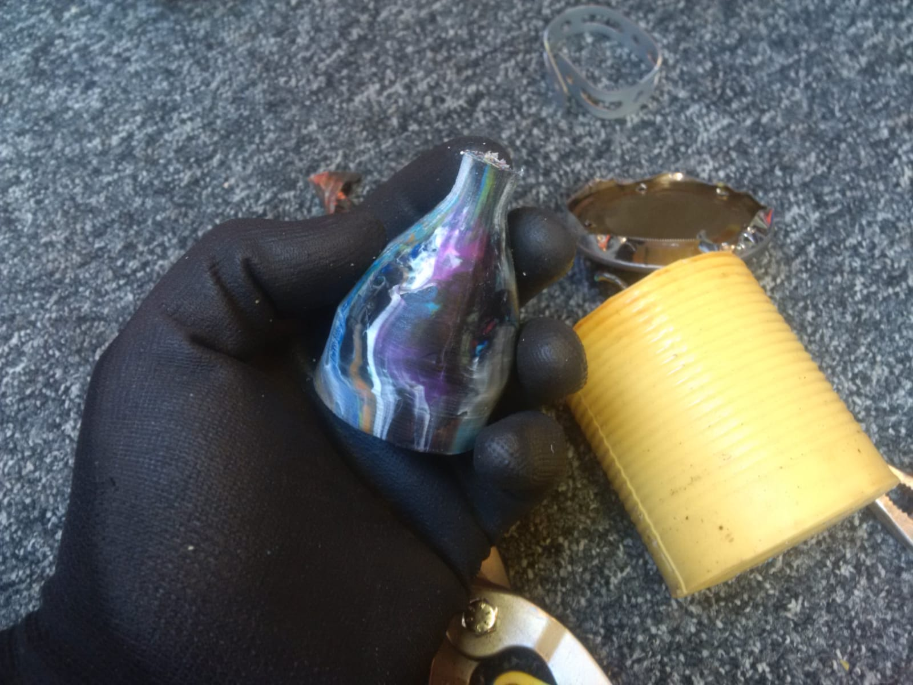
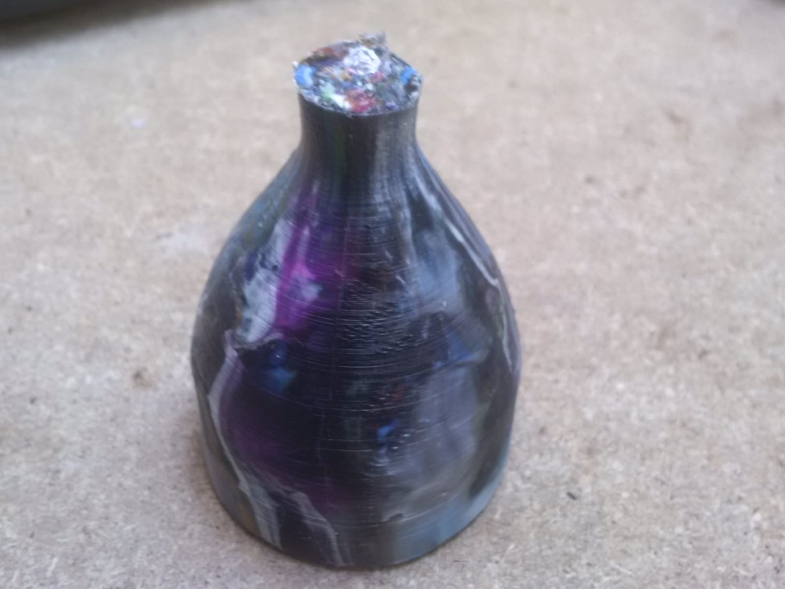
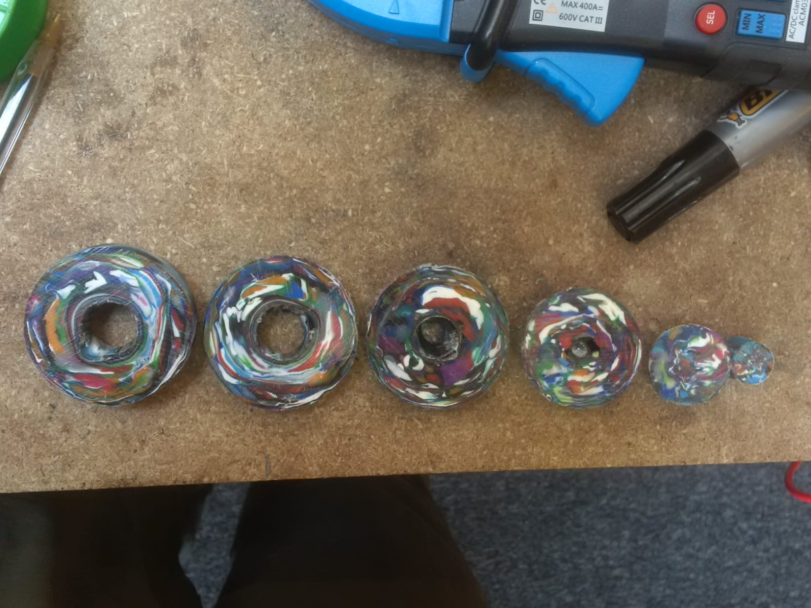

# How To: Resin Cast Barrel Injector

### You will need:

- 3 empty cans
- [High temperature 2-part casting silicone](./s-l1600.jpg)
- plunger- aluminium bar around 40mm diameter, minimum length the same as 1 can
- drill press
- something to make a 'nozzle'- short cylinder eg. half a wine cork
- the object you want to reproduce
- oven
- PPE

### Method:

1. Cast your barrel

Fix your nozzle piece to the end of your plunger, balance it upright in a can, and cast around it with high temp 2 part silicone

When the casting is solid, carefully peel off the metal can (Be careful, it will cut you easily)

Remove the plunger bar from the silicone barrel- a vise can help

Push out your nozzle piece to create the nozzle hole

Trim the end of the barrel to create a flat surface

2. Create your mould

In a similar way, create your mould in a second can. The mould needs to be cut with a razorblade to remove the original part:

3. Your plunger, barrel and mould are ready to go!

Place the mould in an empty can to hold it together.

Fill the barrel with shredded plastic (HDPE), place on a heatproof tray and heat in an oven until melted.

Then (using gloves) place the hot barrel on top of the mould in the drill press.

Plunge the plunger!

After cooling you can remove your injected part from the mould

To check your process, cut open your part and examine for voids

Be safe and enjoy! :)

