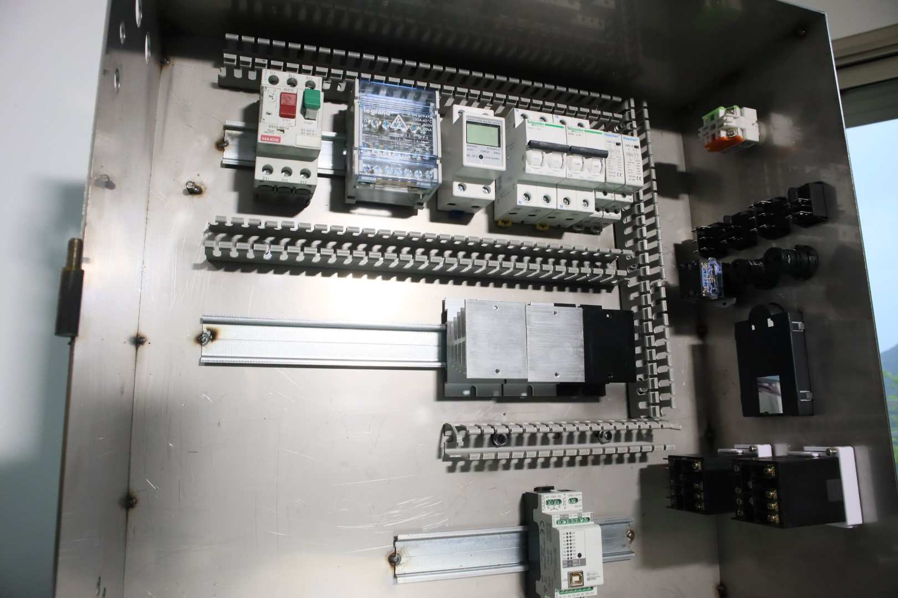
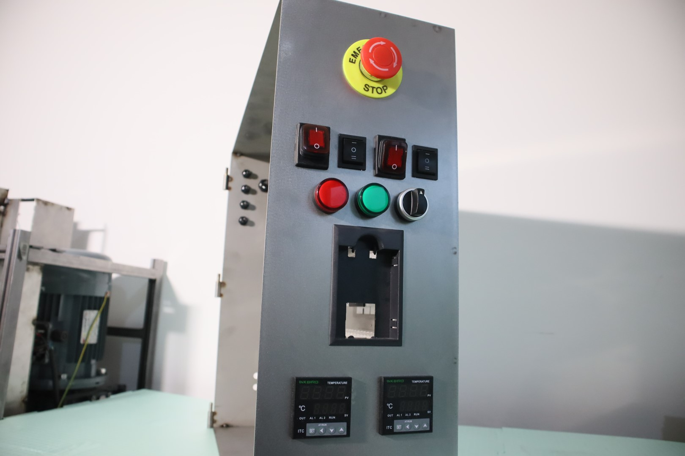
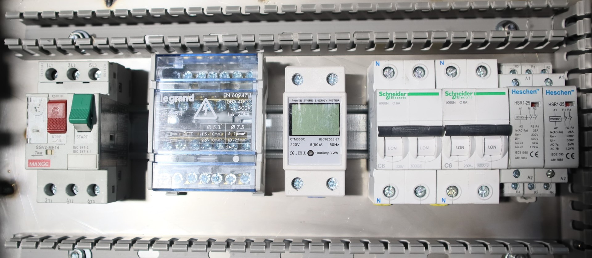

    

# Front panel

from top to bottom, left to right

1. Emergency switch [Amazon](${BOM_ESWTICH}) | [Specs](${SPEC_ESWTICH})

2. Power switch - Shredder [Amazon](${BOM_PSWTICH}) | [Specs](${SPEC_PSWTICH})

3. Direction switch [Amazon](${BOM_DSWTICH}) | [Specs](${SPEC_DSWTICH})

4. Power switch - Extruder [Amazon](${BOM_PSWTICH}) | [Specs](${SPEC_PSWTICH})

5. Auto-Reverse mode switch [Amazon](${BOM_DSWTICH}) | [Specs](${SPEC_DSWTICH})

6. Status LED - Error [Amazon](${BOM_DSWTICH}) | [Specs](${SPEC_ELED})

7. Status LED - Ok [Amazon](${BOM_DSWTICH}) | [Specs](${SPEC_GLED})

8. Momentary Switch [Amazon](${BOM_MSWTICH}) | [Specs](${SPEC_MSWITCH})

9. VFD Control Panel [Amazon](${BOM_VFD}) | [Specs](${SPEC_VFD})

10. Temperature controller [Amazon](${BOM_INKBIRD}) | [Specs](${SPEC_INKBIRD})

    

    

