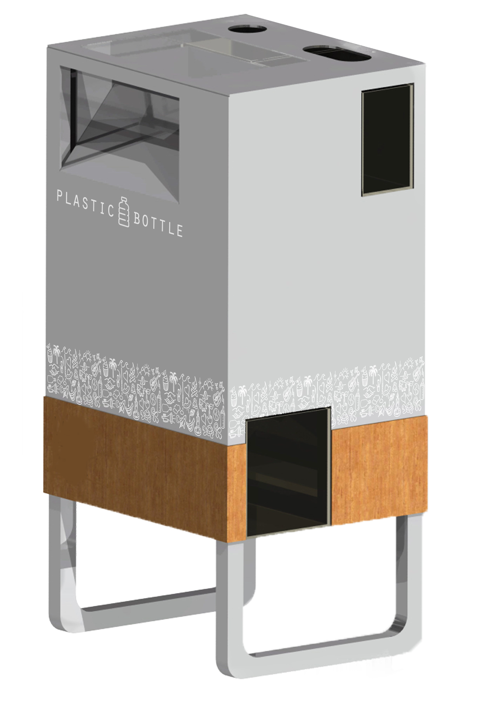

# Overview

**brief** : General overview for a PET bottle vending shredder machine

**document scope** : client, vendor, manufacturer

**version** : 0.2

**status** : design & prototyping

**license** : proprietary

**quick jumps** : - [Firmware](https://github.com/plastic-hub/firmware/tree/asterix/shredder-extrusion/firmware-next) | [Panel Design](./media/DemoRevA.pdf) | [Touchscreen Interface](./hmi)

## Features of the first revision

* IP55 grade housing and electronics
* sound prove
* auto - suspend/resume
* air filters & ventilation
* auto - reverse
* load capacity : 2 large PET bottles at a time
* transport wheels
* auto-shred when hopper is loaded
* LED & audio feedback
* minimal user interface
* power meter
* service & maintenance interface via USB developer port
* 2 cartridges: one big one for PET, one for the bottle caps/lids.both have wheels and a spring loaded door.
* service-door, chassie, enclosure, cartridge - open|close - sensor

### Optional features

* large touchscreen for network KPIs and shredding profiles
* key lock
* haptic buttons
* remote interface (IoT) for online metering
* plastic scanner
* bar code scanner

|  **Component Name** | **Component Section** | **Component Price/Estimate** | **Production/Duration (hours)** | **Design/Prototyping-Duration (hours)** | **Status** | **Risk** |
| --- | --- | --- | --- | --- | --- | --- |
|  Shredder Box | Shredding | 1450 | 24 | 12 | Solved |  |
|  Coupling | Drive | 120 | 4 | 10 | Removed |  |
|  Hopper | Feed | 150 | 6 | 16 | Done |  |
|  Shredder/Motor-Mounts | Framework |  |  |  | Solved |  |
|  Motor | Motor | 560 | 1 | 2 | Solved |  |
|   |  |  |  |  |  |  |
|  Chassie/Enclosure | Framework | 300 | 16 | 24 | Design |  |
|  Panels | Skinning | 200 | 5 | 10 | Solved |  |
|  Ventilation & Airfilter | Framework | 200 | 8 | 16 | Design |  |
|  Segment Joinery | Framework | 150 | 10 | 16 | Solved | Middle |
|  Cartridges | Framework | 200 | 10 | 10 | Design |  |
|  Wheels & mounts | Framework | 100 | 4 | 1 | Design | Middle |
|  Cartridge loaded Sensors | Electronics | 20 | 2 | 1 | Solved |  |
|  Chassie- Sensors | Electronics | 80 | 5 | 10 | Solved |  |
|  Motor Heat Sensors | Electronics | 30 | 2 | 2 | Solved |  |
|  Auto-Reverse | Electronics | 0 | 4 | 2 | Done |  |
|  Feed - Sensor | Electronics | 150 | 2 | 2 | Done |  |
|  Cartridges - Full Sensor | Electronics | 20 | 1 |  | Solved |  |
|  Plunger  | Mechanics | 450 | 1 |  | Testing |  |
|  Touchscreen  | Electronics | 400 | 1 |  | Testing |  |
|  LED Feedback | Electronics | 100 | 3 | 5 | Not tested |  |
|  Main controller | Electronics | 450 | 3 | 5 | Done |  |
|  Audio Feedback | Electronics | 10 | 1 | 1 | Testing |  |
|  Suspend/Resume | Electronics | 100 | 3 | 10 | Done |  |
|  Inverter | Electronics | 250 | 2 | 1 | Done |  |
|   |  |  |  |  |  |  |
|  Control - Board / Fuses/,... | Electronics | 200 | 5 | 1 | Solved |  |
|   |  |  |  |  |  |  |
|  Sourcing,... | Logistics | 150 | 10 |  |  |  |

## References

- [Table Source](https://docs.google.com/spreadsheets/d/1SPyHnEtUMeZ_hL9212lvQF86MP4abl22_4R1H0gXtW0/edit#gid=0)

- [Components Source](https://docs.google.com/spreadsheets/d/1SPyHnEtUMeZ_hL9212lvQF86MP4abl22_4R1H0gXtW0/edit#gid=150475076&range=A1)

- [Drawings](src/components/) | [Renderings](src/renderings)

- [Firmware](https://github.com/plastic-hub/firmware/tree/asterix/shredder-extrusion/firmware-next)

- [Orders](src/orders)

- [Tests](src/tests)

- [Production Parts](src/production)

- [Datasheets](./datasheets)

## Vendor references

[Shredder Test Videos](https://www.morrentrading.com/shredder-s/basis-shredderblok-am2018-200 https://www.morrentrading.com/movies)

[Shredder Pictures](https://www.morrentrading.com/shredder-s/basis-shredderblok-am2018-20)

[Shredder Firmware](https://github.com/plastic-hub/firmware/blob/master/shredder-extrusion/README.md)

