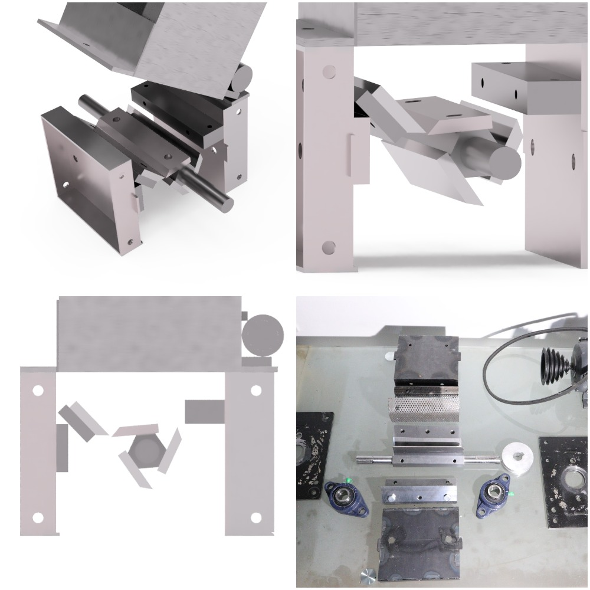

# PET grinder

Variants : Addon, Standalone, Asterix, IdeFix mini

This build can be applied to PP v3 shredders. It only needs a few steel bars and custom made grinder knifes

**brief** : General overview for a PET grinder

**document scope** : client, vendor, manufacturer

**version** : 0.4

**status** : design & prototyping

**license** : open-source

## Files / Components

[Fusion360](./cad) | [3D Online Preview](https://a360.co/2wlHFaB)

[SolidWorks](./cad/solidworks)

[PET Printhead](https://mahor.xyz/producto/v4-pellet-extruder-24v/)

## References

- [Short video rev.3](https://www.youtube.com/watch?v=ElOnSA7pS18&feature=youtu.be)
- [Support channel #pet-grinder](https://discord.gg/j7K7n9e)

## Related

- [Noah umbrella project](https://github.com/plastic-hub/noah/blob/master/machines/Noah.md)
- [PP and filament & 3D-print projects](https://precious-plastic.org/home/library/articles/filament/)
- [PP Wiki - components](https://precious-plastic.org/home/library/components/)
- [PP Forum - PET print](https://davehakkens.nl/community/forums/topic/3d-printer-for-pet-particles-no-filament-ever/)
- [Video - 3D-seed PET Printer](https://www.youtube.com/watch?v=EbxNa3WLpjA)
- [Youtube channel : large scale PET grinder & shredder](https://www.youtube.com/watch?v=3xWvHz9JjjU)
