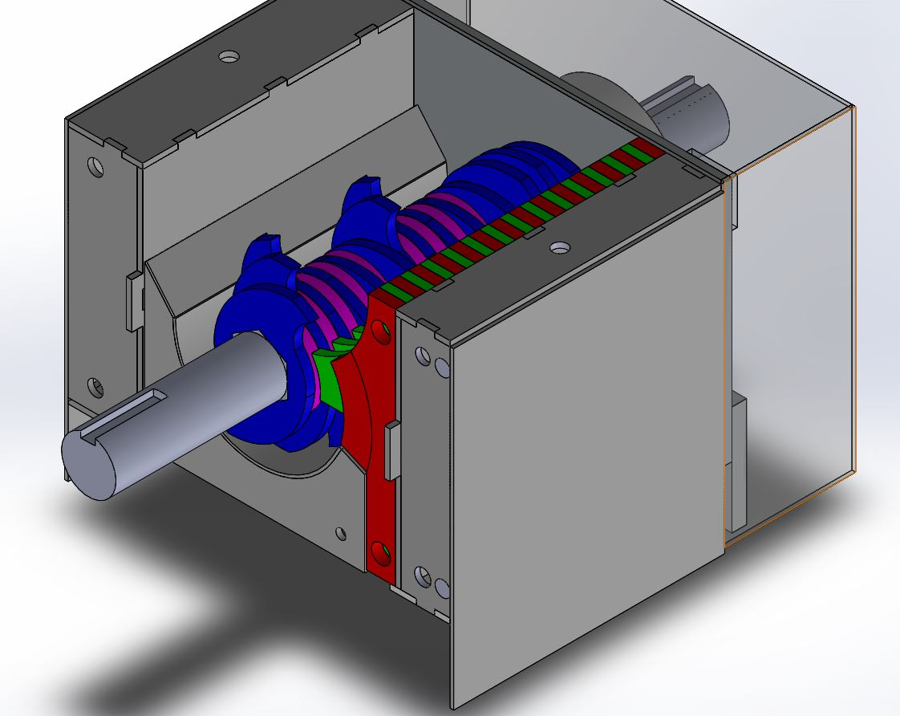
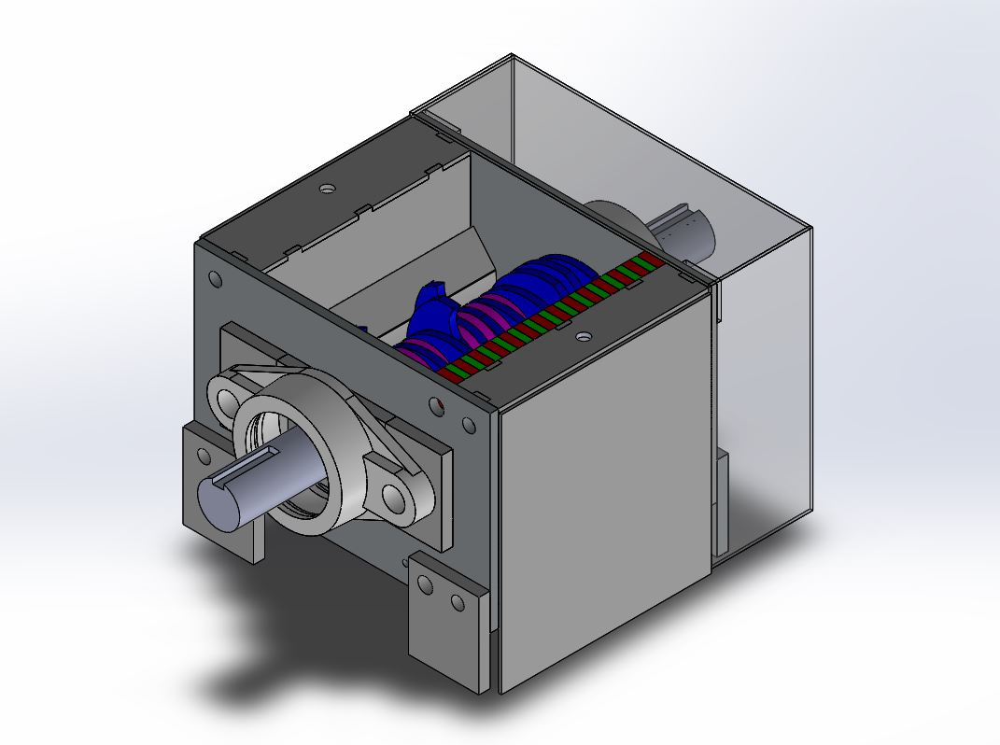

# Plastic-Hub upgrade for the PP Version 3.0 Shredder

**Features / Fixes**

- 30 mm drive shaft, 32mm hexbar
- 2 cm less cutting edge circumference, this should unlock significant more torque
- fits in in v3.1/v3.0
- front and back shield
- side shield

**Changes** :

- adjusted mobile knifes, sieve, hex spacers, stationary knifes
- extra bearing mounting block (UFCL206)

**Status** : **testing** | do not use this yet ! 

## Resources

- [Laser files - DXF](./laser) -  [Overview Stainless](./laser/Shredder_3.2_overview_Inox.PDF) | [Overview Steel](./laser/Shredder_3.2_overview_Ferro.PDF)
- [Drawings](./drawings)
- [CAD - Solidworks](./cad) - [STEP - File](./cad/shredder_v3.2.STEP)
- [Fusion360 3D Online Preview (parts missing)](https://a360.co/2UXQFuX)

## Todos

- integrate latest hopper (with sensors: loaded, closed)
- integrate automatic plunger
