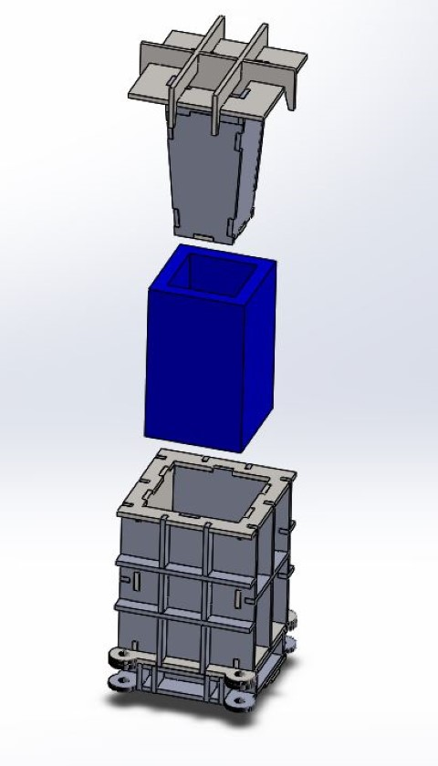

# Precious Plastic v4 Brick Mold

**Credits** : Developed by [Precisous Plastic Endhoven](http://preciousplastic.com/) in coorp with [Recyclerebuild](https://www.recyclerebuild.org/) - please check their other projects.

**Status** : tested, CAD incomplete but in progress

## Components & files

### Single Brick

- [Single brick CAD (Solidworks)](./cad/01_SINGLE) | [Drawing PDF](./drawings/Brick_single_ALL-Parts.PDF)

- **Weight** : ~1Kg
- **Mold size** : 100x100x165mm

------------------------------------------------------------------

**Note**: the other moulds are in progress

## Resources

- [Community Howto](https://community.preciousplastic.com/how-to/make-extruded-plastic-bricks)

- @Todo: add and update similar projects
