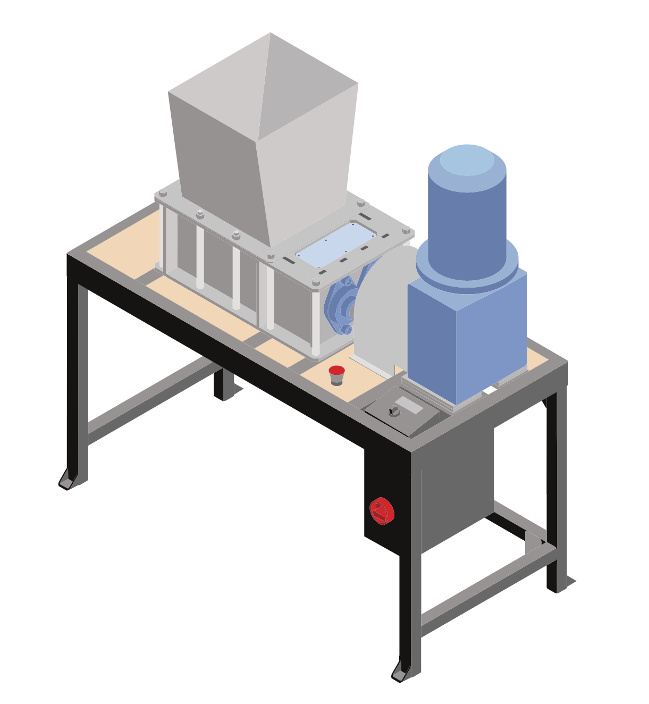

# Precious Plastic Machine Library

Cheat sheets &amp; more compact version of PP v3, v3.1 v4

## Version 3

<a href="./shredder/">
    
     
    
Shredder

</a>

<a href="./compression/">
    
     
    
Extrusion

</a>

<a href="./compression/">
    
     
    
compression

</a>

<a href="./compression/">
    
     
    
injection

</a>

## Version v4

[Drawings](./drawings) | [CAD](./CAD) | [Laser](./laser) | [BOM](./bom)

## todos

- apply machine, component & part templates
- replace urls with pp-search
- cleanup solidworks
- correct specs

### shredder

### extrusion

### sheetpress
- portable framework

